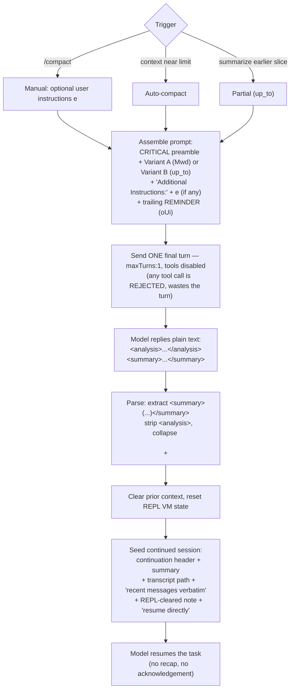

# How Claude Code generates compact summaries (reverse-engineered)

Extracted verbatim from the Claude Code CLI binary, **v2.1.181**
(`@anthropic-ai/claude-code`, the Bun-compiled `bin/claude.exe` single-file
executable, ~233 MB). All strings below are quoted exactly as stored in the
binary. Nothing here is from documentation — it's the actual embedded prompt
strings and the surrounding JS that assembles them.

## TL;DR mechanism

Compaction (whether triggered by `/compact`, auto-compact on context overflow,
or a "summarize up to here" partial) works by sending the model **one final
turn** whose instruction is a fixed summary prompt. The model must reply with
plain text only — `<analysis>...</analysis>` followed by `<summary>...</summary>`
— and tool calls are explicitly rejected for that turn. The `<summary>` block is
parsed out and becomes the seed of the continued session.

The assembled prompt is:

```
[CRITICAL preamble]  +  [summary-body: variant A *or* variant B]  +  [optional "Additional Instructions:\n" + user text]  +  [trailing constant]
```

There are **two summary-body variants**, chosen by a mode parameter:

- **Variant A — full / end-of-conversation** (the default; internal constant `Mwd`).
  Sections end with **Current Work** and **Optional Next Step**. Used by
  `/compact` and auto-compact when the whole conversation is being replaced.
- **Variant B — "up_to" / partial** (selected when mode `=== "up_to"`).
  Sections end with **Work Completed** and **Context for Continuing Work**. Used
  when summarizing only an earlier slice, with newer messages following the
  summary.

The relevant assembler (lightly de-minified from the binary):

```js
// mode-switched builder (variant B when t === "up_to", else variant A = Mwd)
function buildSummaryPrompt(t, e) {
  let r = `CRITICAL: Respond with TEXT ONLY. Do NOT call any tools.
- Do NOT use Read, Bash, Grep, Glob, Edit, Write, or ANY other tool.
- You already have all the context you need in the conversation above.
- Tool calls will be REJECTED and will waste your only turn — you will fail the task.
- Your entire response must be plain text: an <analysis> block followed by a <summary> block.
` + (t === "up_to"
        ? `Your task is to create a detailed summary of this conversation. ...`   // Variant B
        : Mwd);                                                                    // Variant A
  if (e && e.trim() !== "") r += `\nAdditional Instructions:\n${e}`;   // user's custom compact instructions
  return r += oUi, r;   // oUi = the trailing REMINDER constant (see §7)
}

// standard builder (always Variant A)
function Uwn(e) {
  let t = `CRITICAL: Respond with TEXT ONLY. Do NOT call any tools.
- Do NOT use Read, Bash, Grep, Glob, Edit, Write, or ANY other tool.
- You already have all the context you need in the conversation above.
- Tool calls will be REJECTED and will waste your only turn — you will fail the task.
- Your entire response must be plain text: an <analysis> block followed by a <summary> block.
` + `Your task is to create a detailed summary of the conversation so far, ...`;   // Variant A
  ...
}
```

`e` is the user-supplied compact instruction (e.g. the argument to `/compact`,
or a `## Compact Instructions` block found in context). `—` is an em-dash.

---

## Sequence of events

### Triggers

Compaction starts in one of three ways:

- **Manual** — user runs `/compact [optional instructions]`.
- **Auto** — the context window approaches its limit; auto-compact fires.
- **Partial ("up_to")** — only an earlier slice is summarized, with newer
  messages left to follow the summary.

The first two use **Variant A** (sections end with *Current Work* / *Optional
Next Step*). The partial path uses **Variant B** (*Work Completed* / *Context for
Continuing Work*).

### Flow



### Who does what

```mermaid
sequenceDiagram
    actor User
    participant CC as Claude Code (CLI)
    participant LLM as Model

    User->>CC: /compact [instructions]  (or auto-trigger)
    CC->>CC: Build summary prompt (preamble + variant + extras)
    CC->>LLM: Final turn — TEXT ONLY, no tools (maxTurns:1)
    Note over LLM: Tool calls are rejected;<br/>only one turn allowed
    LLM-->>CC: <analysis>…</analysis><summary>…</summary>
    CC->>CC: Extract <summary>, collapse blank lines
    CC->>CC: Clear old context, reset REPL VM state
    CC->>LLM: New session seeded with summary + continuation notes
    LLM-->>User: Resume work directly (no recap)
```

### Step detail

1. **Trigger** — manual `/compact`, auto on overflow, or partial `up_to`.
2. **Assemble** — concatenate: CRITICAL preamble (§1) → summary body (Variant A
   `Mwd` §2 or Variant B §3) → `Additional Instructions:\n${e}` if the user gave
   any (§4) → trailing REMINDER `oUi` (§4b).
3. **Single constrained turn** — sent via the `reactive-compact` path with
   `querySource: "compact"`, **`maxTurns: 1`**, `skipTranscript: true`,
   `skipCacheWrite: true`. All tools are rejected; plain text only.
4. **Model output** — an `<analysis>` block (scratchpad) followed by a
   `<summary>` block structured into the 9 numbered sections.
5. **Parse** — keep the capture group of `<summary>([\s\S]*?)<\/summary>`,
   discard the `<analysis>`, collapse runs of blank lines (`\n\n+`) (§5).
6. **Reset** — prior turns are dropped from context; REPL VM state is cleared.
7. **Re-seed** — the next session opens with the continuation strings (§6).
8. **Resume** — the model picks up the last task "as if the break never
   happened."

---

## 1. CRITICAL preamble (prepended to every variant)

```
CRITICAL: Respond with TEXT ONLY. Do NOT call any tools.
- Do NOT use Read, Bash, Grep, Glob, Edit, Write, or ANY other tool.
- You already have all the context you need in the conversation above.
- Tool calls will be REJECTED and will waste your only turn — you will fail the task.
- Your entire response must be plain text: an <analysis> block followed by a <summary> block.
```

---

## 2. Variant A — full / end-of-conversation summary (constant `Mwd`)

```
Your task is to create a detailed summary of the conversation so far, paying close attention to the user's explicit requests and your previous actions.
This summary should be thorough in capturing technical details, code patterns, and architectural decisions that would be essential for continuing development work without losing context.

Before providing your final summary, wrap your analysis in <analysis> tags to organize your thoughts and ensure you've covered all necessary points. In your analysis process:

1. Chronologically analyze each message and section of the conversation. For each section thoroughly identify:
   - The user's explicit requests and intents
   - Your approach to addressing the user's requests
   - Key decisions, technical concepts and code patterns
   - Specific details like:
     - file names
     - full code snippets
     - function signatures
     - file edits
   - Errors that you ran into and how you fixed them
   - Pay special attention to specific user feedback that you received, especially if the user told you to do something differently.
   - Note any security-relevant instructions or constraints the user stated (e.g., sensitive files or data to avoid, operations that must not be performed, credential or secret handling rules). These MUST be preserved verbatim in the summary so they continue to apply after compaction.
2. Double-check for technical accuracy and completeness, addressing each required element thoroughly.

Your summary should include the following sections:

1. Primary Request and Intent: Capture all of the user's explicit requests and intents in detail
2. Key Technical Concepts: List all important technical concepts, technologies, and frameworks discussed.
3. Files and Code Sections: Enumerate specific files and code sections examined, modified, or created. Pay special attention to the most recent messages and include full code snippets where applicable and include a summary of why this file read or edit is important.
4. Errors and fixes: List all errors that you ran into, and how you fixed them. Pay special attention to specific user feedback that you received, especially if the user told you to do something differently.
5. Problem Solving: Document problems solved and any ongoing troubleshooting efforts.
6. All user messages: List ALL user messages that are not tool results. These are critical for understanding the users' feedback and changing intent. Preserve any security-relevant instructions or constraints verbatim so they remain in effect after compaction.
7. Pending Tasks: Outline any pending tasks that you have explicitly been asked to work on.
8. Current Work: Describe in detail precisely what was being worked on immediately before this summary request, paying special attention to the most recent messages from both user and assistant. Include file names and code snippets where applicable.
9. Optional Next Step: List the next step that you will take that is related to the most recent work you were doing. IMPORTANT: ensure that this step is DIRECTLY in line with the user's most recent explicit requests, and the task you were working on immediately before this summary request. If your last task was concluded, then only list next steps if they are explicitly in line with the users request. Do not start on tangential requests or really old requests that were already completed without confirming with the user first.
                       If there is a next step, include direct quotes from the most recent conversation showing exactly what task you were working on and where you left off. This should be verbatim to ensure there's no drift in task interpretation.

Here's an example of how your output should be structured:

<example>
<analysis>
[Your thought process, ensuring all points are covered thoroughly and accurately]
</analysis>

<summary>
1. Primary Request and Intent:
   [Detailed description]

2. Key Technical Concepts:
   - [Concept 1]
   - [Concept 2]
   - [...]

3. Files and Code Sections:
   - [File Name 1]
      - [Summary of why this file is important]
      - [Summary of the changes made to this file, if any]
      - [Important Code Snippet]
   - [File Name 2]
      - [Important Code Snippet]
   - [...]

4. Errors and fixes:
    - [Detailed description of error 1]:
      - [How you fixed the error]
      - [User feedback on the error if any]
    - [...]

5. Problem Solving:
   [Description of solved problems and ongoing troubleshooting]

6. All user messages:
    - [Detailed non tool use user message]
    - [...]

7. Pending Tasks:
   - [Task 1]
   - [Task 2]
   - [...]

8. Current Work:
   [Precise description of current work]

9. Optional Next Step:
   [Optional Next step to take]

</summary>
</example>

Please provide your summary based on the conversation so far, following this structure and ensuring precision and thoroughness in your response.

There may be additional summarization instructions provided in the included context. If so, remember to follow these instructions when creating the above summary. Examples of instructions include:
<example>
## Compact Instructions
When summarizing the conversation focus on typescript code changes and also remember the mistakes you made and how you fixed them.
</example>

<example>
# Summary instructions
When you are using compact - please focus on test output and code changes. Include file reads verbatim.
</example>
```

---

## 3. Variant B — "up_to" / partial summary

Same preamble and `<analysis>`/example scaffolding, but a different opening and
different final two sections (it knows newer messages will follow it).

Opening:

```
Your task is to create a detailed summary of this conversation. This summary will be placed at the start of a continuing session; newer messages that build on this context will follow after your summary (you do not see them here). Summarize thoroughly so that someone reading only your summary and then the newer messages can fully understand what happened and continue the work.
```

Section list (note 1, 6, 8, 9 differ from Variant A):

```
1. Primary Request and Intent: Capture the user's explicit requests and intents in detail
2. Key Technical Concepts: List important technical concepts, technologies, and frameworks discussed.
3. Files and Code Sections: Enumerate specific files and code sections examined, modified, or created. Include full code snippets where applicable and include a summary of why this file read or edit is important.
4. Errors and fixes: List errors encountered and how they were fixed.
5. Problem Solving: Document problems solved and any ongoing troubleshooting efforts.
6. All user messages: List ALL user messages that are not tool results. Preserve any security-relevant instructions or constraints verbatim so they remain in effect after compaction.
7. Pending Tasks: Outline any pending tasks.
8. Work Completed: Describe what was accomplished by the end of this portion.
9. Context for Continuing Work: Summarize any context, decisions, or state that would be needed to understand and continue the work in subsequent messages.
```

Example block (mirrors the section list):

```
<example>
<analysis>
[Your thought process, ensuring all points are covered thoroughly and accurately]
</analysis>
<summary>
1. Primary Request and Intent:
   [Detailed description]
2. Key Technical Concepts:
   - [Concept 1]
   - [Concept 2]
3. Files and Code Sections:
   - [File Name 1]
      - [Summary of why this file is important]
      - [Important Code Snippet]
4. Errors and fixes:
    - [Error description]:
      - [How you fixed it]
5. Problem Solving:
   [Description]
6. All user messages:
    - [Detailed non tool use user message]
7. Pending Tasks:
   - [Task 1]
8. Work Completed:
   [Description of what was accomplished]
9. Context for Continuing Work:
   [Key context, decisions, or state needed to continue the work]
</summary>
</example>
Please provide your summary following this structure, ensuring precision and thoroughness in your response.
```

---

## 4. Optional user "Additional Instructions"

If a custom instruction `e` is present (non-empty after trim), this is appended
after the body:

```
Additional Instructions:
${e}
```

---

## 4b. Trailing REMINDER constant (`oUi`, appended last to every prompt)

```

REMINDER: Do NOT call any tools. Respond with plain text only — an <analysis> block followed by a <summary> block. Tool calls will be rejected and you will fail the task.
```

(Leading newline is part of the constant.) Dispatch details from the
`reactive-compact` path: the prompt is sent with `querySource: "compact"`,
`forkLabel: "reactive-compact"`, **`maxTurns: 1`**, `skipTranscript: true`,
`skipCacheWrite: true`, a capped `maxOutputTokens`, and a fallback model — i.e.
exactly one constrained turn, no transcript write-back.

---

## 5. Output parsing

After the model responds, the `<summary>` block is extracted and newlines
collapsed. The regexes stored in the binary:

```
<analysis>[\s\S]*?<\/analysis>
<summary>([\s\S]*?)<\/summary>     (capture group → the kept summary)
<summary>[\s\S]*?<\/summary>
\n\n+                              (collapse runs of blank lines)
```

A `Summary:` label string is also stored (used when rendering the result).

---

## 6. Continuation message injected into the *next* session

Once a summary exists, the continued session is seeded with these strings
(stored adjacent to the prompt in the binary):

```
This session is being continued from a previous conversation that ran out of context. The summary below covers the earlier portion of the conversation.
```

```
If you need specific details from before compaction (like exact code snippets, error messages, or content you generated), read the full transcript at: <path>
```

```
Recent messages are preserved verbatim.
```

```
Your REPL VM state has been cleared as part of this compaction. Variables defined in REPL calls before this point are no longer accessible — redefine any you still need.
```

```
Continue the conversation from where it left off without asking the user any further questions. Resume directly — do not acknowledge the summary, do not recap what was happening, do not preface with "I'll continue" or similar. Pick up the last task as if the break never happened.
```

---

## How this was extracted (reproducible)

```sh
b=~/.local/share/mise/installs/node/<ver>/lib/node_modules/@anthropic-ai/claude-code/bin/claude.exe

# locate
grep -a -b -o 'Your task is to create a detailed summary' "$b"
grep -a -b -o 'Your entire response must be plain text'   "$b"

# pull a clean window and run through `strings`
dd if="$b" bs=1 skip=<offset> count=4600 2>/dev/null | strings -n 4
```

The prompt text is stored twice in the binary (two byte ranges, byte-identical),
once around 102.7 MB and once around 218.9 MB; the 218.9 MB copy is clean ASCII
and shows the surrounding JS (`function Uwn`, the `t === "up_to"` ternary, the
`Mwd`/`oUi` constants) used to assemble it.
