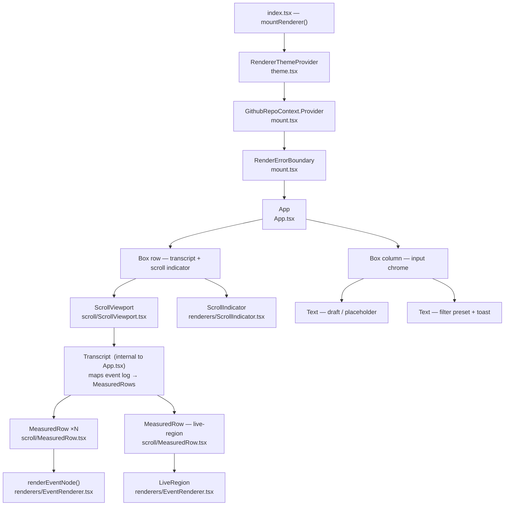

# Renderer component hierarchy

Reference for the React (Ink) component composition in `packages/renderer/src/`.

## Component composition tree

Who renders whom, from the library entry point down to the scroll and input chrome.

`RendererThemeProvider` wraps the entire tree (including the error-boundary fallback render) so the palette is available everywhere via `useRendererTheme()`. `GithubRepoContext` sits just inside it and supplies the origin repo used by `MarkdownRenderer` for GitHub autolinks (`#123`, `@mention`, bare SHA).

`RenderErrorBoundary` is a class-component boundary: a render-time throw anywhere in `App`'s subtree is caught here and replaced with a minimal `<App initialEvents={[parse_error …]} />` instead of crashing the host `fnc` process.

**Transcript** is a function component defined in `App.tsx` (not a separate file). It owns no scroll state; it maps the committed event log and the in-flight live preview to `MeasuredRow` children and notifies the scroll controller of their order via `ctl.setOrderedIds`.

**Scroll seam.** `ScrollViewport` clips its children to `height` rows using Ink's `overflowY="hidden"` and shifts the inner box up by `-scrollOffset` as a negative `marginTop`. It reports the full unclipped content height back up via `onContentHeight`. Each `MeasuredRow` wraps one event's rendered node and reports its own height via `onHeight`. The `useAnchoredScroll` hook in `App` owns all scroll state (offset, max, anchoring), sized to `terminalRows − 2` (two rows reserved for the input chrome).

## Event → renderer dispatch

How `renderEventNode` routes each `ClaudeEvent` type to a concrete renderer.

```mermaid
flowchart TD
    ren["renderEventNode(event, ctx)\nrenderers/EventRenderer.tsx"]

    ren -->|user_prompt| UPR["UserPromptRender"]
    ren -->|user| UR["UserRender"]
    ren -->|assistant| AR["AssistantRender"]
    ren -->|result| RR["ResultRend (local)"]
    ren -->|system| SR["SystemRend (local)"]
    ren -->|rate_limit_event| RLR["RateLimitRend (local)"]
    ren -->|parse_error| rj0["RawJson"]
    ren -->|stream_event| rj1["RawJson  (defensive)"]

    UPR --> MR1["MarkdownRenderer"]

    UR -->|text block| txt1["Text (Ink)"]
    UR -->|tool_result block| TRR["ToolResultRenderer"]

    TRR -->|Bash| BO["BashOutput"]
    TRR -->|Read| RC["ReadContent"]
    TRR -->|is_error| ER1["ErrorRenderer"]
    TRR -->|other| txt2["Text (Ink)"]

    AR -->|text block| MR2["MarkdownRenderer"]
    AR -->|thinking block| TR["ThinkingRenderer"]
    AR -->|tool_use block| TUR["ToolUseRenderer"]
    AR -->|usage present| TB["TokenBurn"]

    TUR -->|Bash| BI["BashInput"]
    TUR -->|Edit| ED["EditDiff"]
    TUR -->|Read| RI["ReadInput"]
    TUR -->|Write| WC["WriteContent"]
    TUR -->|Task| TN["TaskNested"]
    TUR -->|unknown| rj2["RawJson"]

    RR -->|is_error| ER2["ErrorRenderer"]
    RR -->|suppressBody| null0["null"]
    RR -->|default| ResultRenderer["ResultRenderer"]

    SR -->|subtype init, meta shown| SI["SystemInit"]
    SR -->|subtype init, meta hidden| null1["null"]
    SR -->|subtype status| txt3["dim Text"]
    SR -->|other, meta shown| rj3["RawJson"]
    SR -->|other, meta hidden| null2["null"]

    RLR -->|meta shown| rj4["RawJson"]
    RLR -->|meta hidden| null3["null"]
```

`AssistantRender`, `UserRender`, and the local `ResultRend`/`SystemRend`/`RateLimitRend` wrappers are all defined in `EventRenderer.tsx`. Per-tool and block renderers live in their own files under `renderers/`.

**`Filtered`** (`renderers/Filtered.tsx`) is the shared 4-way visibility dispatcher consumed by the per-tool renderers (`BashInput`, `BashOutput`, `ReadContent`, `EditDiff`, `WriteContent`, `TaskNested`, `ThinkingRenderer`). It dispatches on `Visibility` — `hide | summary | dim | show` — so the exhaustiveness check lives in one place rather than being copied into each renderer.

**`LiveRegion`** (also in `EventRenderer.tsx`) renders the in-flight token-streaming preview. In-flight text blocks go through `MarkdownRenderer` with `remend` healing to close any dangling syntax. In-flight `thinking` blocks go through `ThinkingRenderer`. In-flight `tool_use` blocks show a dim placeholder — the `partialJson` is never parsed mid-stream, so no styled component can render it yet.

**`MarkdownRenderer`** (`renderers/MarkdownRenderer.tsx`) composes:

| token type | component |
|---|---|
| fenced code | `CodeBlock` |
| table | `TableBlock` |
| blockquote `[!NOTE]` / `[!WARNING]` … | `AlertBlock` |
| `link` token, raw `<a href>` | `Link` (OSC 8 hyperlink when supported) |
| leaf text run | `AutolinkedText` → `Link` for GitHub autolink forms |

The `Link` component is the single source of truth for OSC 8 hyperlink wrapping: it also handles markdown `link` tokens and raw `<a href>` inline HTML, so the blue-underline style and click behavior are consistent everywhere.
