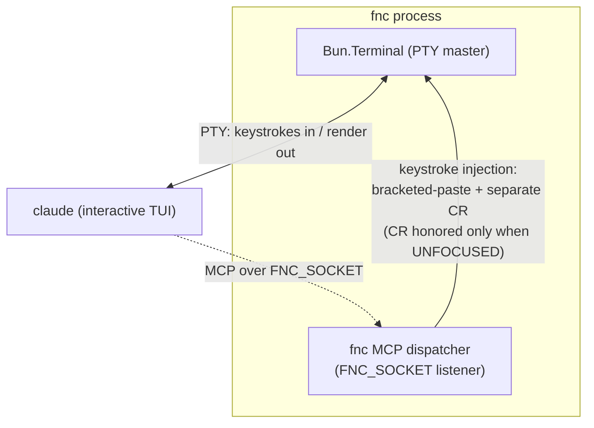
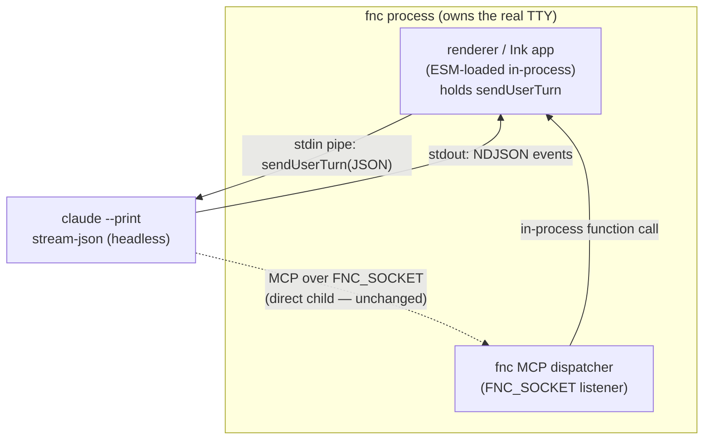
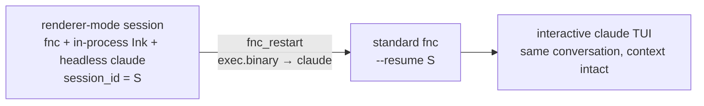

# fnclaude — renderer↔CLI in-process integration design

> **Forward-looking.** This document describes a design that is NOT yet implemented. It is a forward-looking architecture decision, not a description of shipped code. See [`decisions.md`](decisions.md) for decisions that have already landed.

For the empirical findings that de-risk this design (slash-command interception over the pipe, cross-mode resume), see [`packages/renderer/docs/stream-json-findings.md`](../packages/renderer/docs/stream-json-findings.md).

---

## 1. The problem

In standalone mode (today's architecture), fnc drives claude's interactive TUI by injecting keystrokes onto the PTY master — bracketed-paste body followed by a separate CR. Claude's TUI line editor only honors the auto-submit CR when it sees itself unfocused. That unfocused check is an anti-clobber guard downstream of fnc. fnc always sends the CR, but it only fires when the user's window is not focused. So injected submits silently fail while the user's window is active.



Tools that need to send a slash command (compact, model change, effort change) go through this injection path. The focus gate makes them unreliable when the user is actively working in the window.

---

## 2. Chosen design: in-process ESM, renderer as optional dependency

fnc loads the renderer via dynamic `import('@fnclaude/renderer')` — an optional dependency, loaded only when present AND selected. Selection happens at launch time via a config field or flag (e.g. an `exec.binary`-style config entry), not at runtime via discovery.

When combined, fnc hosts the Ink app **in its own process** and holds the renderer's `sendUserTurn` handle directly. Claude runs as fnc's headless `--print` stream-json child. The fnc→renderer channel is a **function call**, not IPC. Claude→fnc stays exactly as today (MCP over `FNC_SOCKET`; claude is fnc's direct child, so the socket dial is unchanged). Renderer→claude is `sendUserTurn(text)` over claude's stdin — out of band of the Ink TUI's own input box. No keystrokes, no focus gate, no bracketed-paste, no clipboard, no length ceiling.



**`request_compact` in combined mode:**

```mermaid
sequenceDiagram
    participant C as claude (headless)
    participant F as fnc MCP dispatcher
    participant R as renderer (in-process)
    C->>F: request_compact  (MCP over FNC_SOCKET)
    F->>R: sendUserTurn("/compact …")  [function call]
    R->>C: {"type":"user", … "/compact"}  on stdin
    Note over C: intercepts /compact locally<br/>model:"&lt;synthetic&gt;", num_turns:0
    C-->>R: synthetic assistant + result (NDJSON)
    F-->>C: { action: "queued" }
```

---

## 3. Capability negotiation

Combined-mode capability is a single launch-time boolean: did the dynamic import resolve AND was combined mode selected? fnc knows the answer before anything starts. No runtime discovery handshake is needed.

Existing MCP tools (compact, effort, model) upgrade their fulfillment in combined mode: they route through `sendUserTurn` instead of PTY keystroke injection. Genuinely-new renderer-only tools register only in combined mode. Both behaviors are driven by the same boolean.

---

## 4. Restart-out: returning to the standard claude session

Leaving combined mode is `fnc_restart` (already shipped) with `exec.binary` reverting to plain `claude`, re-execing `fnc --resume <session_id>`. Works because print-born sessions live in the standard on-disk store (`~/.claude/projects/<cwd-slug>/<session_id>.jsonl`) with context intact — proven in [`packages/renderer/docs/stream-json-findings.md`](../packages/renderer/docs/stream-json-findings.md).

Restarting INTO renderer mode is the same move in the other direction: `fnc_restart` with `exec.binary` set to the renderer-enabled fnc invocation. Toggling the renderer on or off around a stable session is the existing restart mechanism with one flag flipped.



---

## 5. Rejected alternatives

### 5.1. Separate-process renderer + dedicated IPC channel

A second unix socket (`FNC_RENDERER_SOCKET`) or an inherited control fd, with a register/handshake/liveness/ack protocol and a versioned wire handshake for skew.

**Rejected.** In-process collapses the IPC channel to a function call, version-skew handling to a semver dependency range, capability detection to "did the import resolve," and liveness to "is the object there." All the invented IPC machinery disappears. The inherited-fd variant was additionally risky given Bun's spawn-fd story — see [`specs/bun-pty-spawn.md`](../bun-pty-spawn.md).

### 5.2. Reusing the claude↔fnc MCP socket for the fnc→renderer edge

Bending the existing MCP socket to carry fnc→renderer push.

**Rejected.** MCP dispatch is one-shot request→response→close. The fnc→renderer edge wants push (and ideally ack) — a different lifecycle. Bending one onto the other contorts the dispatch path without eliminating any real complexity.

---

## 6. Costs and tradeoffs

| Cost | Notes |
|---|---|
| **Shared crash domain** | An unhandled Ink/React throw can take down fnc, which is also the MCP server and launch orchestrator. The separate-process model isolated this. Mitigation: React error boundary + top-level guard. A dead UI usually means the session is over regardless. This is the real price of in-process. |
| **Optional React/Ink in fnc's dep tree** | As an optional dependency it is not installed unless the user wants the renderer, and not loaded unless mounted — opt-in, not baseline. |
| **Two launch branches** | Standalone: fnc owns a `Bun.Terminal` PTY; claude interactive under it; slash-injection via PTY keystrokes. Combined: fnc does NOT create a PTY; in-process Ink owns the real TTY; claude is a pipe child with no PTY; slash-injection via `sendUserTurn`. fnc forks early on the mode. |

---

## 7. Required refactor: `mountRenderer` API

The renderer's `subscribeToClaude` subscription is currently created inside `App`'s `useEffect`, which traps `sendUserTurn` inside component state. Combined mode needs a programmatic `mountRenderer(...)` that:

1. Creates the subscription.
2. Passes it into `App` as a prop.
3. Returns `{ sendUserTurn, close }` to the caller.

`App` already has injection seams in this style (`initialEvents`, `testInputBus`). Standalone `index.tsx` calls `mountRenderer()` and ignores the return handle; fnc keeps the handle. This refactor is good API hygiene regardless of combined mode.

---

## 8. Empirical basis

Two load-bearing facts proven in [`packages/renderer/docs/stream-json-findings.md`](../packages/renderer/docs/stream-json-findings.md) de-risk this design:

1. `/compact` sent over the pipe hits the genuine intercepted compact command — `model: "<synthetic>"`, `num_turns: 0`. No PTY injection needed.
2. Print-born sessions resume with full context from the standard on-disk store.

One item still unproven: interactive-TUI resume as distinct from the `--print` resume tested. Low-risk since both read the identical store, but not separately verified.
