# Renderer dependency / sequencing chart

Planning scaffold for the ffnc renderer effort. Diamonds = **unmade decisions** with
diverging child paths; green = **shipped**; arrows = "must precede". Independent
subgraphs (and independent leaves within them) are the parallelism surface.

```mermaid
flowchart TD
  %% ===================== SHIPPED =====================
  SH1[#272 table cell width]:::done
  SH2[#273 parse memoization]:::done

  %% ===================== PERF / RENDER MODE =====================
  subgraph PERF[Perf and render mode]
    DFLICK{Flicker: ship now?}
    FLICK[DEC 2026 sync-output flicker fix]
    HOLD[parked]
    DSCROLL{Scroll model?}
    NATIVE[Keep native scroll + text-selection]
    APPSCROLL[App-owned scroll / DECSTBM viewport]
    SCROLLBASIC[Autoscroll + unseen divider, scroll-to-bottom, perm auto-scroll]
    SCROLLTRUE[True scroll-to + flash]
  end
  DFLICK -->|go| FLICK
  DFLICK -->|hold| HOLD
  DSCROLL -->|native| NATIVE
  DSCROLL -->|app-owned| APPSCROLL
  NATIVE --> SCROLLBASIC
  APPSCROLL --> SCROLLBASIC
  APPSCROLL --> SCROLLTRUE

  %% ===================== GFM =====================
  subgraph GFM[GFM rendering]
    OSC8[#1 OSC8 clickable links + @mention]
    DSUB{#4 sub/sup form?}
    SUBU[Unicode sub/superscript]
    SUBA[ASCII _2 / ^2]
    DEMOJI{#5a add node-emoji?}
    EMOJI[Emoji shortcodes]
    ENOEM[skip - leave literal]
    KBD[#6 kbd nerdfont glyphs]
    FOOT[#7 footnotes marked-ext + circled nums]
  end
  DSUB -->|unicode| SUBU
  DSUB -->|ascii| SUBA
  DEMOJI -->|yes| EMOJI
  DEMOJI -->|no| ENOEM

  %% ===================== GRAPHICS =====================
  subgraph GFX[Graphics]
    GFXDET[Terminal-graphics protocol detection]
    DSTATIC{Static filter-repaint: a or b?}
    STATIC[Ink Static foundation]
    IMAGES[Inline images Kitty]
    CHAFA[chafa fallback cascade]
    SVGPNG[SVG to PNG via resvg]
    MATH[Math / LaTeX]
    MERMAID[Mermaid diagrams]
    HASHC[Diagram hash cache]
    BINDET[Lazy mmdc binary detect]
    IMGLIFE[Image eviction by ID]
    IMGBUD[Per-image size budgets]
    IMGRESIZE[Downscale on resize]
    PASTE[Pasted-image thumbnails]
    MULTIIMG[Multi-image per turn]
    OVERLAY[Layered overlay selection]
    SATORI[Arbitrary HTML via Satori]
    UMATH[Unicode-math approx fallback]
  end
  DSTATIC -->|a new-content-only| STATIC
  DSTATIC -->|b remount-on-toggle| STATIC
  GFXDET --> IMAGES
  GFXDET --> CHAFA
  STATIC --> IMAGES
  IMAGES --> IMGLIFE
  IMAGES --> IMGBUD
  IMAGES --> IMGRESIZE
  IMAGES --> PASTE
  IMAGES --> MULTIIMG
  SVGPNG --> MATH
  SVGPNG --> MERMAID
  IMAGES --> MATH
  IMAGES --> MERMAID
  BINDET --> MERMAID
  HASHC --> MERMAID
  IMAGES --> OVERLAY
  APPSCROLL --> OVERLAY
  SVGPNG --> SATORI
  IMAGES --> SATORI

  %% ===================== INTERACTIVITY =====================
  subgraph INTER[Interactivity]
    MOUSE[Mouse tracking opt-in mode]
    FOCUSMGR[FocusManager keyboard nav]
    COLLAPSE[Collapsible details/summary]
    CUSTSEL[Custom text selection]
    BPASTE[Bracketed paste]
    FOCUSEV[Focus-change events]
  end
  FOCUSMGR --> COLLAPSE
  MOUSE --> CUSTSEL
  APPSCROLL --> CUSTSEL

  %% ===================== COCKPIT =====================
  subgraph COCK[Subagent cockpit]
    DBACK{Cockpit backend?}
    TMUXSHELL[tmux + shell only]
    ALLBACK[all 6 pane backends]
    DBG{Background subagent mode?}
    BGINV[headless exec]
    PANEVIS[pane per subagent]
    CHROME[Status chrome: icons, glyphs, duration, tokens, activity, haiku summary]
    PANEL[Agent panel: select/foreground/interrupt/stop]
    GROUP[Agent view grouping buckets]
    WFTREE[Workflow progress tree]
    BCAST[Broadcast messaging]
    GRACE[Release grace window]
    IDLEHIDE[Idle auto-hide]
    TVIEW[Subagent transcript viewer]
    DBILL{Billing: separate or bundled?}
    DNEST{Nested pane sharing?}
  end
  DBACK -->|tmux+shell| TMUXSHELL
  DBACK -->|all| ALLBACK
  DBG -->|invisible| BGINV
  DBG -->|visible pane| PANEVIS
  TMUXSHELL --> DBG
  PANEVIS --> PANEL
  BGINV --> PANEL
  CHROME --> PANEL
  PANEL --> GROUP
  PANEL --> WFTREE
  PANEL --> BCAST
  PANEL --> TVIEW
  PANEL --> GRACE
  PANEL --> IDLEHIDE
  PANEL --> DNEST
  TMUXSHELL --> DBILL

  %% ===================== MULTIPANE =====================
  subgraph MULTI[Multipane workspace]
    EMBTMUX[Embedded static tmux]
    ORCH[Orchestrator + Unix socket]
    TMUXLIFE[tmux lifecycle / orphan cleanup]
    NVIM[Neovim RPC auto-open]
    TABPERSIST[Per-tab editor persistence]
    HOTKEY[Global hotkey scheme]
  end
  EMBTMUX --> ORCH
  TMUXSHELL --> ORCH
  ORCH --> TMUXLIFE
  ORCH --> NVIM
  NVIM --> TABPERSIST
  ORCH --> HOTKEY

  %% ===================== CROSS-CUTTING =====================
  FOOT -.optional jump.-> SCROLLTRUE
  MATH -.fallback.-> UMATH

  classDef done fill:#2ea043,stroke:#1a7f37,color:#fff
  classDef dec fill:#f5d547,stroke:#b8860b,color:#000
  class DFLICK,DSCROLL,DSUB,DEMOJI,DSTATIC,DBACK,DBG,DBILL,DNEST dec
```

## Decision nodes (must resolve before their children)

| # | Decision | Paths | Blocks |
|---|---|---|---|
| DFLICK | Ship flicker fix now? | go / hold | the flicker cure (everything else independent) |
| DSCROLL | Scroll model | native vs app-owned | true scroll-to+flash, custom selection, overlay selection |
| DSUB | sub/sup form | Unicode vs ASCII | #4 impl |
| DEMOJI | add node-emoji dep | yes vs no | #5a impl |
| DSTATIC | Static filter-repaint | a new-content-only vs b remount | Static foundation → all images |
| DBACK | Cockpit backend | tmux+shell vs all 6 | orchestrator + cockpit base |
| DBG | Background subagent mode | invisible vs visible pane | panel surface |
| DBILL | Billing model | separate vs bundled | spawn policy |
| DNEST | Nested pane sharing | share vs own-up-to-max | pane bounding |

## Parallelism surface (independent tracks)

These have **no shared dependencies** and can run concurrently from day one:

1. **GFM leaves** — OSC8 (#1), kbd (#6), footnotes (#7) are independent; sub/sup (#4) and emoji (#5a) unblock the moment DSUB / DEMOJI are answered. All small, all parallel.
2. **Flicker fix** — single self-contained change, gated only on DFLICK.
3. **Input primitives** — bracketed paste, focus-change events: tiny, independent of everything.
4. **Graphics foundation** — `terminal-graphics detection` + `SVG→PNG` are the gate for the whole graphics column; start them early, everything image/math/mermaid hangs off them.
5. **FocusManager → collapsible** — keyboard-first, independent of mouse/scroll.

**Serial spines (do not parallelize within):**

- Graphics: `detection → Static (after DSTATIC) → images → {math, mermaid, lifecycle, budgets, paste}`. Math/Mermaid additionally need `SVG→PNG`; Mermaid also needs binary-detect + hash-cache.
- Scroll/selection: `DSCROLL → app-owned scroll → {true scroll-to, custom selection, overlay}`. Custom selection also needs mouse tracking.
- Cockpit: `DBACK → tmux+shell → DBG → panel → {grouping, workflow tree, broadcast, transcript viewer, grace, idle-hide}`. Status chrome feeds the panel and can be built in parallel ahead of it.
- Multipane: `embedded tmux → orchestrator → {nvim → tab-persist, hotkeys, lifecycle}`. Shares the tmux backend with the cockpit.

## Effort tiers

- **Near-term (small, GFM/perf-adjacent):** all GFM items, flicker fix, bracketed paste, focus events, scroll-basic, graphics-detection, SVG→PNG, image budgets/lifecycle/resize.
- **Mid (medium):** Static foundation, inline images, math, mermaid, collapsible, autoscroll+divider, neovim RPC.
- **Roadmap (large):** app-owned scroll, custom selection, overlay selection, subagent cockpit (whole column), multipane workspace (whole column), Satori HTML.
